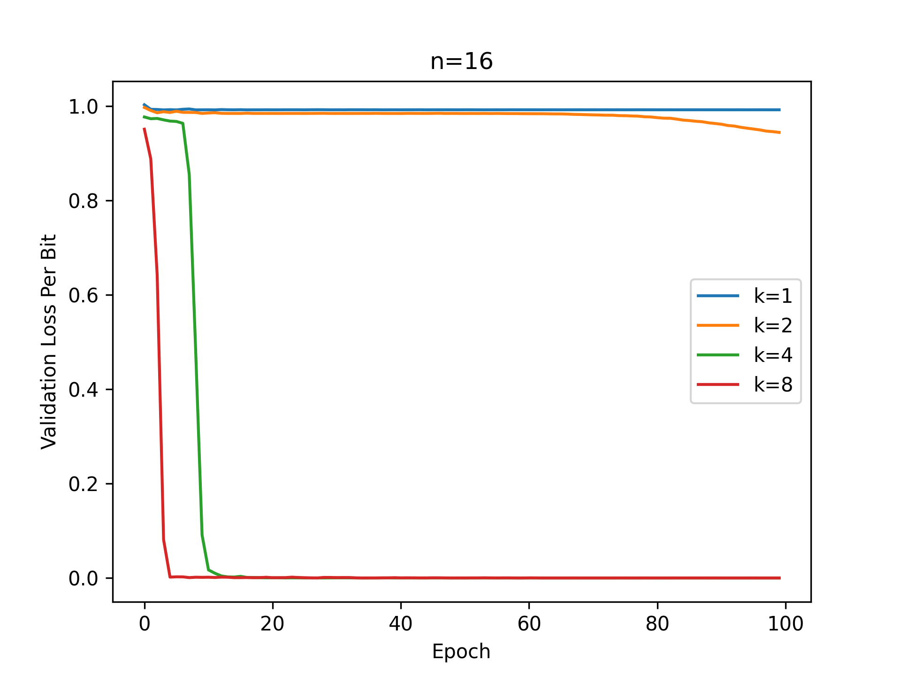
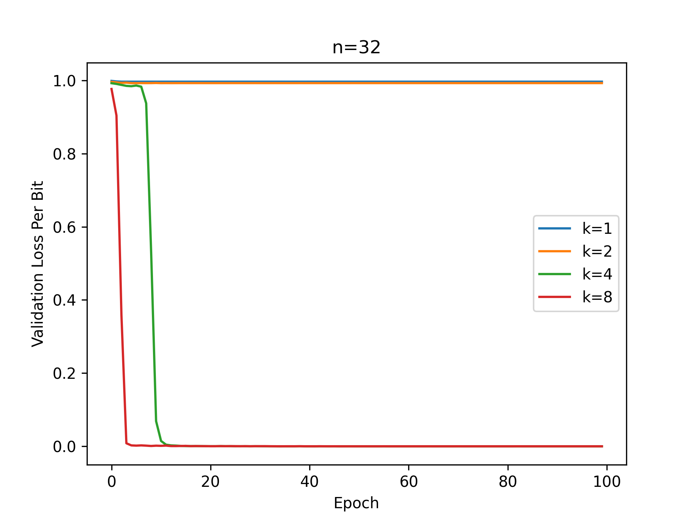

# An Artificial Subword Translation Task
**Ken Sible | [NLP Group](https://nlp.nd.edu)** | **University of Notre Dame**

<details>

<summary><b>No Pooling</b></summary>





</details>

<details>

<summary><b>RNN Pooling</b></summary>


</details>

## Training Example
- To generate training/validation data, see [translation.ipynb](/translation.ipynb).
- To generate bash scripts for experiments, see [param_array.sh](/param_array.sh).
```
$ python translation/main.py --train-data data_bits/train_8_1.tsv --val-data data_bits/val_8_1.tsv --sw-vocab data_bits/vocab_8_1.tsv --model data_bits/model_8_1.pt --log data_bits/model_8_1.log --kernel-size 8
```

## CLI Reference
### Training
```
usage: main.py [-h] --train-data FILE_PATH --val-data FILE_PATH --sw-vocab FILE_PATH --model FILE_PATH --log FILE_PATH [--seed SEED]

options:
  -h, --help            show this help message and exit
  --train-data FILE_PATH
                        parallel training data
  --val-data FILE_PATH  parallel validation data
  --sw-vocab FILE_PATH  subword vocab
  --model FILE_PATH     translation model
  --log FILE_PATH       logger output
  --seed SEED           random seed
```

### Translation
```
usage: translate.py [-h] --sw-vocab FILE_PATH --model FILE_PATH [--input INPUT]

options:
  -h, --help            show this help message and exit
  --sw-vocab FILE_PATH  subword vocab
  --model FILE_PATH     translation model
  --input INPUT         detokenized input
```

